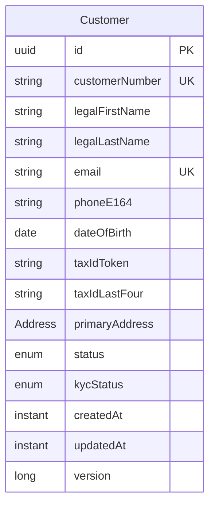

# Customer Model Only — Scaled-Back Plan

## Scope

**In scope** — four files in [`untitled/src/main/java/org/example/model/`](untitled/src/main/java/org/example/model/):

- [`Address.java`](untitled/src/main/java/org/example/model/Address.java) — new `@Embeddable`
- [`Customer.java`](untitled/src/main/java/org/example/model/Customer.java) — rewrite per redesigned field set
- [`CustomerStatus.java`](untitled/src/main/java/org/example/model/CustomerStatus.java) — update enum values
- [`KycStatus.java`](untitled/src/main/java/org/example/model/KycStatus.java) — update enum values

**Out of scope** (deferred):

- Spring Boot migration, `application.yml`, `FintechBankingApplication`
- `CustomerRepository`, `CustomerService`, `CustomerNumberGenerator`
- Flyway migrations
- Tests
- Changes to [`Main.java`](untitled/src/main/java/org/example/Main.java)

## Dependencies

Keep existing [`untitled/pom.xml`](untitled/pom.xml) as-is (Jakarta Persistence + Hibernate). Add one lightweight dependency for Bean Validation annotations used on the entity:

```xml
<dependency>
    <groupId>jakarta.validation</groupId>
    <artifactId>jakarta.validation-api</artifactId>
    <version>3.1.0</version>
</dependency>
```

No Spring, no H2, no Flyway.

## Model design



### `Address` — `@Embeddable`

Fields: `line1`, `line2` (optional), `city`, `stateProvince`, `postalCode`, `countryCode` (ISO 3166-1 alpha-2).

Embedded in `Customer` via `@Embedded` + `@AttributeOverrides` mapping to prefixed columns (`address_line1`, `address_city`, etc.).

### `CustomerStatus`

```java
PROSPECT, ACTIVE, SUSPENDED, CLOSED
```

Replaces current `ACTIVE, INACTIVE, SUSPENDED, CLOSED` — drop `INACTIVE`, add `PROSPECT`.

### `KycStatus`

```java
NOT_STARTED, PENDING, APPROVED, REJECTED
```

Replaces current `PENDING, IN_REVIEW, VERIFIED, REJECTED`.

### `Customer` — key mappings

| Field | Notes |
|-------|-------|
| `id` | `UUID`, `GenerationType.UUID` |
| `customerNumber` | unique, `updatable = false`; set via package-private setter (service assigns later) |
| `legalFirstName` / `legalLastName` | `@NotBlank @Size(max=100)` |
| `email` | `@NotBlank @Email`, unique constraint |
| `phoneE164` | `@NotBlank @Pattern` for E.164 (`^\+[1-9]\d{1,14}$`) |
| `dateOfBirth` | `@NotNull @Past` |
| `taxIdToken` | opaque vault reference, `@NotBlank` |
| `taxIdLastFour` | `@NotBlank @Pattern(regexp="\\d{4}")` |
| `primaryAddress` | `@NotNull @Embedded` |
| `status` | defaults to `PROSPECT` |
| `kycStatus` | defaults to `NOT_STARTED` |
| `createdAt` / `updatedAt` | `@PrePersist` / `@PreUpdate` |
| `version` | `@Version` optimistic locking |

Constructor: public constructor accepting all fields **except** `customerNumber` (assigned before persist by a future service). Protected no-arg constructor for JPA.

`equals`/`hashCode` based on `id` only (same pattern as existing entity).

## File changes summary

1. **Add** [`Address.java`](untitled/src/main/java/org/example/model/Address.java)
2. **Rewrite** [`Customer.java`](untitled/src/main/java/org/example/model/Customer.java) — replace `firstName`/`lastName`/`phoneNumber`/`taxIdentifier` with redesigned fields + embedded address
3. **Update** [`CustomerStatus.java`](untitled/src/main/java/org/example/model/CustomerStatus.java)
4. **Update** [`KycStatus.java`](untitled/src/main/java/org/example/model/KycStatus.java)
5. **Add** `jakarta.validation-api` to [`pom.xml`](untitled/pom.xml)

No other files touched.

## Verification

Run `mvn -f untitled compile` to confirm the model compiles against existing dependencies.
